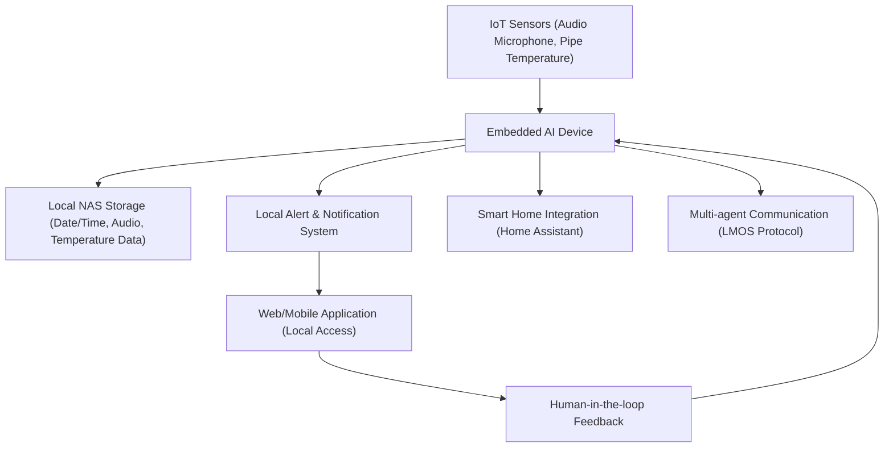

# pAIpesense (Concept)

**Smart IoT & AI-Powered Water Leak Detection (Project Idea)**

## Concept Overview

pAIpesense is envisioned as an intelligent system utilizing IoT sensors and embedded Artificial Intelligence to detect water leaks and pipe damages at an early stage. The project aims to proactively identify issues locally, avoiding potential water damage, reducing maintenance costs, and maintaining infrastructure integrity without relying on cloud-based AI. Due to limited initial data, human oversight is incorporated to manage false positives and facilitate continuous learning. Additionally, pAIpesense is designed to integrate seamlessly with smart home platforms, such as Home Assistant, and function as an agent within multi-agent systems using protocols like LMOS for inter-agent communication.

## Potential Features

- Real-time monitoring of pipes
- On-device AI-enhanced detection algorithms
- Immediate alerts and notifications
- User-friendly installation and easy integration
- Local data storage on Network Attached Storage (NAS)
- Human-in-the-loop feedback mechanism
- Continuous on-device learning capability
- Integration with smart home solutions (e.g., Home Assistant)
- Multi-agent system capability (LMOS protocol)

## Planned Implementation Steps

1. Research and development of sensor technology.
2. Prototype creation and integration with local IoT network.
3. Data collection and storage on NAS for initial AI training.
4. Development of on-device AI-based analysis engine.
5. Integration of human-in-the-loop feedback system.
6. Deployment and continuous improvement of AI accuracy through local learning.
7. Development of integration modules for smart home platforms.
8. Implementation of multi-agent communication using LMOS or similar protocols.
9. Testing and refinement through pilot implementations.

## Proposed Architecture

## Future Usage (Concept)

Upon successful development, users would monitor pipes locally via a dedicated web interface, mobile application, or through their smart home platform, receiving real-time alerts about potential leaks or anomalies. Users' feedback will continuously improve the detection accuracy of the embedded AI. Additionally, the device will communicate and coordinate with other intelligent agents in a smart home ecosystem.

---

**Summary:**  
pAIpesense aims to intelligently detect water leaks using IoT sensors and on-device AI technologies, proactively safeguarding infrastructure locally, with continuous learning, human-in-the-loop feedback, seamless smart home integration, and multi-agent system capabilities.

