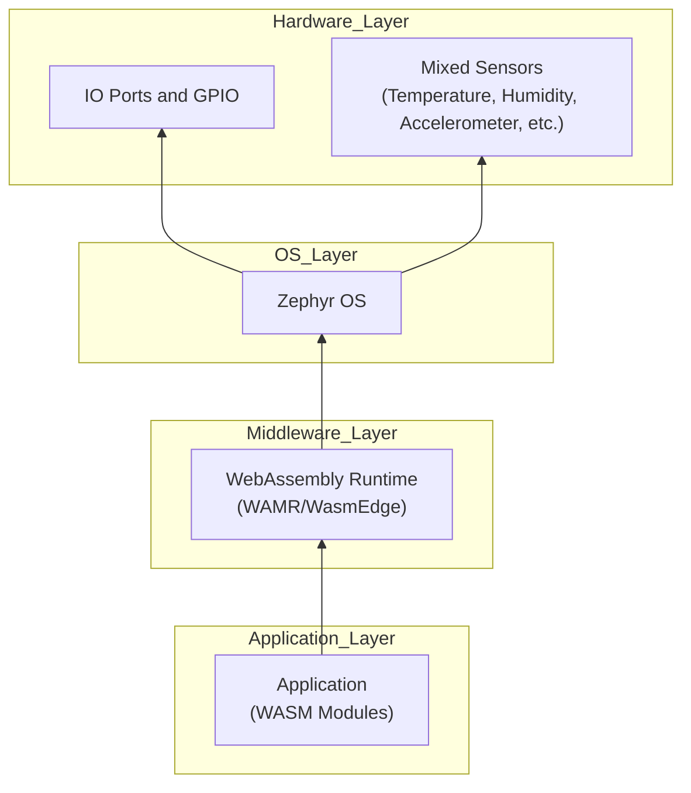

### Device Architecture Diagram

The device architecture diagram illustrates how the hardware, operating system, runtime, and application logic are layered in a system using Zephyr OS and the WebAssembly Micro Runtime (WAMR) on an Arduino Nano 33 BLE Sense.

#### Explanation of Device Architecture
- **Arduino Nano 33 BLE Sense**: This is the hardware platform, a microcontroller board with sensors and Bluetooth capabilities, serving as the foundation of the system.
- **Zephyr OS**: A real-time operating system that runs on the Arduino Nano 33 BLE Sense, managing hardware resources and providing a platform for higher-level software.
- **WAMR (WebAssembly Micro Runtime)**: Hosted by Zephyr, WAMR is a lightweight runtime that executes WebAssembly (WASM) modules on resource-constrained devices.
- **WASM Module**: A compiled WebAssembly binary that contains the application logic, executed by WAMR.
- **Application Logic**: The specific functionality of the system (e.g., sensor data processing or communication), implemented within the WASM module.

This hierarchical structure shows how each component builds on the one below it, from the hardware up to the application logic.

---

### Development Process Diagram

The development process diagram outlines the steps to create, compile, integrate, and deploy an application to the device.

#### Explanation of Development Process
1. **Write Application in C/Rust**: Start by writing the application code in a high-level language like C or Rust. These languages are commonly used due to their performance and compatibility with WebAssembly.
2. **Compile to WASM**: Use tools like Emscripten (for C) or wasm-pack (for Rust) to compile the application into a WebAssembly (WASM) module, a portable binary format.
3. **Integrate with Zephyr**: Incorporate the WASM module into a Zephyr project. This step involves configuring the Zephyr build system to include the WASM module and setting up interfaces for hardware interaction.
4. **Build and Flash to Device**: Build the complete firmware (Zephyr, WAMR, and the WASM module) using the Zephyr SDK, then flash it to the Arduino Nano 33 BLE Sense using a tool like bossac.
5. **Run on Arduino Nano 33 BLE Sense**: Once flashed, the application runs on the device, with WAMR executing the WASM module under Zephyr’s management.

This linear flowchart makes it easy to follow the sequence of steps from coding to deployment.

---

### Additional Notes
- **Practical Tips**:
  - Ensure you have the Zephyr SDK and necessary compilers installed (see [Zephyr Getting Started](https://docs.zephyrproject.org/latest/develop/getting_started/index.html)).
  - Be prepared to write glue code to connect the WASM module to Zephyr’s hardware drivers.
  - Use debugging tools like Zephyr’s logging or a hardware debugger to troubleshoot issues.
